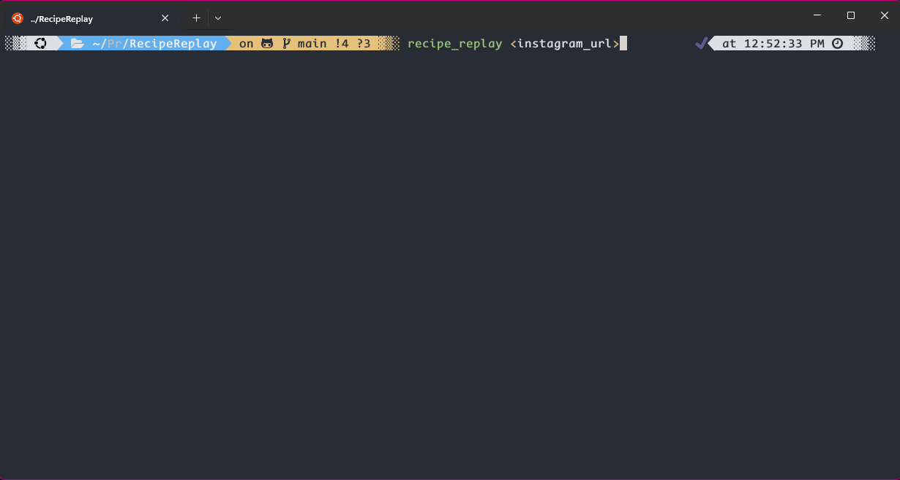
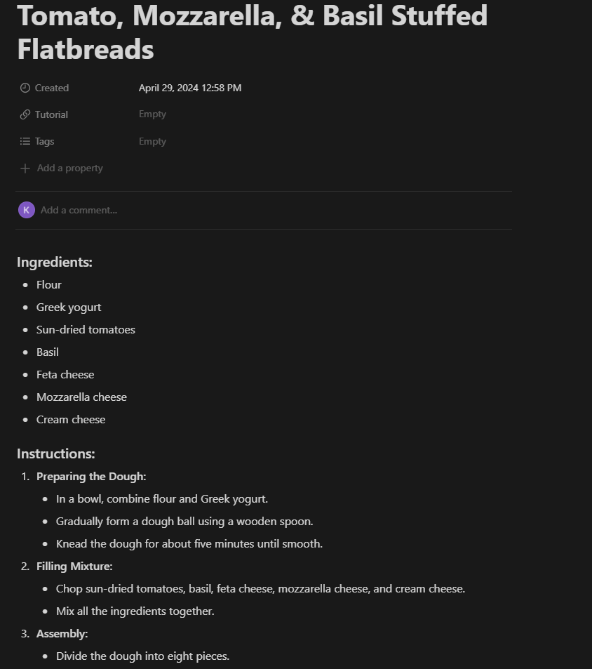

# RecipeReplay

## Introduction
Welcome to RecipeReplay! This project is inspired by my recent culinary adventures. Since graduating college, I've had more time to explore my passions, one of which is cooking. I found myself frequently learning from online videos but was frustrated by the constant need to pause, rewind, and fast-forward, which disrupted the flow of cooking. To streamline this process, I created RecipeReplay, a tool that converts cooking videos into easy-to-follow written recipes.

## How It Works
RecipeReplay automates the process of extracting cooking instructions from videos. It downloads a video from a provided Instagram link, extracts the audio, and uses OpenAI's Whisper model to transcribe the speech. Then, it utilizes GPT-3.5-turbo to format and summarize the instructions into a concise recipe. The final formatted recipe can be saved directly to your "Cookbook" page on Notion or any other digital notebook.

## Setup
To run RecipeReplay, you'll need:
- Python 3.8+
- Playwright for Python
- MoviePy
- Requests library
- dotenv
- An OpenAI API key (you need to obtain this yourself from OpenAI's website)

### Installation
1. Clone this repository.
2. Install the required Python packages:
   ```bash
   pip install -r requirements.txt
   ``` 
3. Create a `keys.env` file at the root of the project and add your OpenAI API key:
    ```bash 
    SECRET_KEY='your_api_key_here'
    ``` 

### Usage
To use RecipeReplay, simply run the provided Zsh script with the Instagram video URL: 

